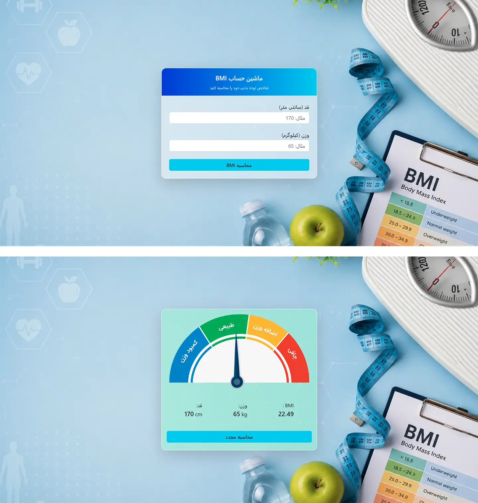

# Fast BMI Calculator Website

A BMI Calculator website built with HTML, CSS, Bootstrap and vanila JavaScript .

## Features

* Calculate BMI by getting height and weight from user
* Measure your health statement
* Modern and clean user interface
* Fully structured HTML and CSS

## Technologies

* HTML5
* CSS3
* JavaScript (Vanilla JS)
* Bootstrap 5

## Project Preview

## Live Demo

[View Live Demo](https://hosseinmehrbakhsh.github.io/BMI-calculator/)

## Author

Hossein Mehrbakhsh
